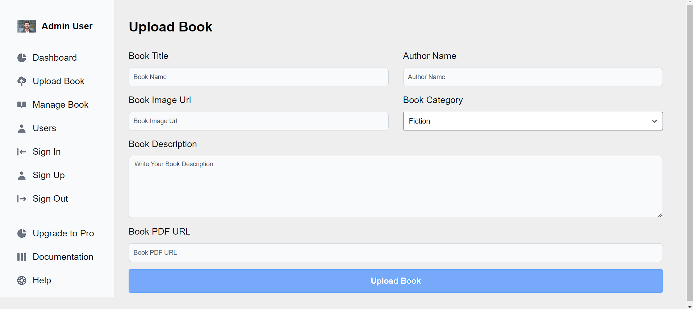

# Online Bookstore Inventory Management Website

## Overview

The Online Bookstore Inventory Management Website is a comprehensive solution for managing bookstore inventories efficiently. This project includes inventory management and an authentication system, ensuring secure access to inventory data. It is developed using the MERN stack, Firebase, and Postman API.

## Features

- **Inventory Management**: Add, edit, delete, and view books in the inventory.
- **Authentication System**: Secure user authentication and authorization using Firebase.
- **User Roles**: Different user roles (admin, customer) with specific permissions.
- **Search and Filter**: Search and filter books based on various criteria.
- **Responsive Design**: Fully responsive design for a seamless user experience across all devices.
- **API Integration**: Postman API endpoints for managing inventory data.

## Technologies Used

- **MongoDB**: For the database.
- **Express.js**: For the backend framework.
- **React**: For the frontend framework.
- **Node.js**: For the backend runtime environment.
- **Firebase**: For authentication.
- **Postman**: For API testing.

## Screenshots

### Home Page

### Inventory Management

### User Authentication

