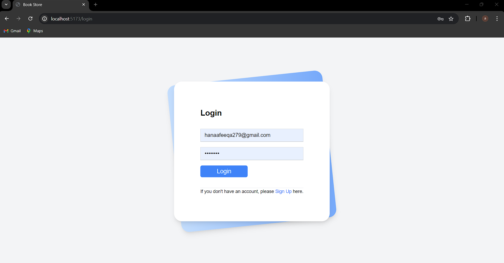

# Online Bookstore Inventory Management Website

## Overview

This project is an online bookstore inventory management system developed using the MERN stack (MongoDB, Express.js, React, and Node.js). It includes features for managing inventory and user authentication, making it a comprehensive solution for managing a bookstore's online presence.

## Features

- **Inventory Management**: Add, edit, delete, and view books in the inventory.
- **Authentication System**: User registration and login functionality.
- **User Roles**: Different user roles (admin, customer) with specific permissions.
- **Search and Filter**: Search and filter books based on various criteria.
- **Responsive Design**: Fully responsive design for a seamless user experience across all devices.

## Technologies Used

- **MongoDB**: For the database.
- **Express.js**: For the backend framework.
- **React**: For the frontend framework.
- **Node.js**: For the backend runtime environment.

## Screenshots

### Home Page

### Inventory Management

### User Authentication

